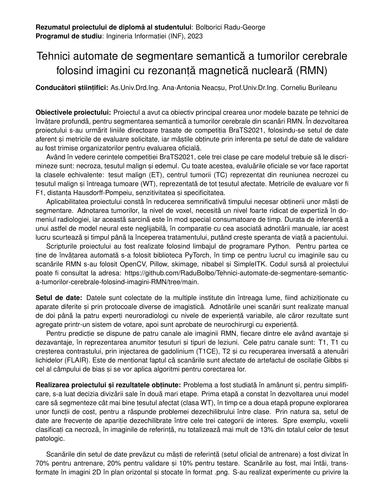
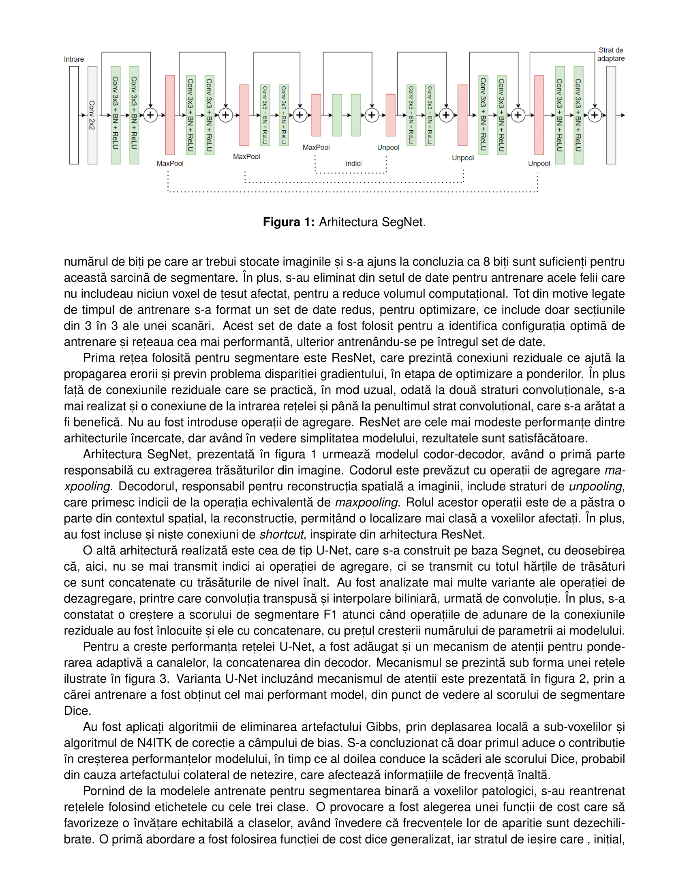
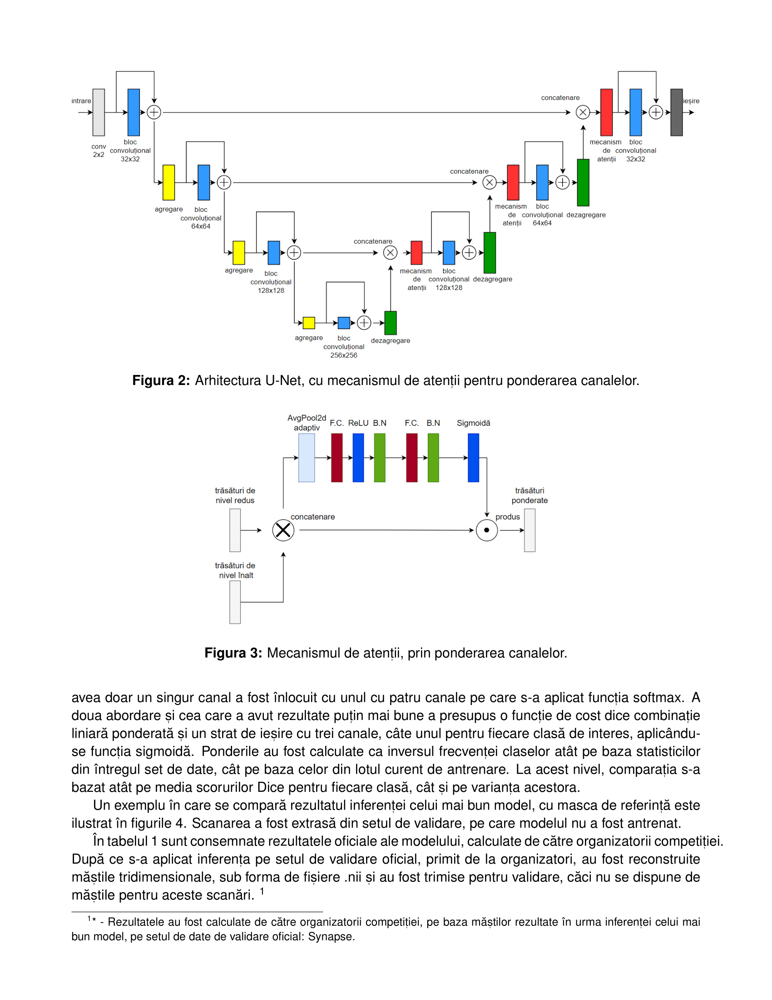
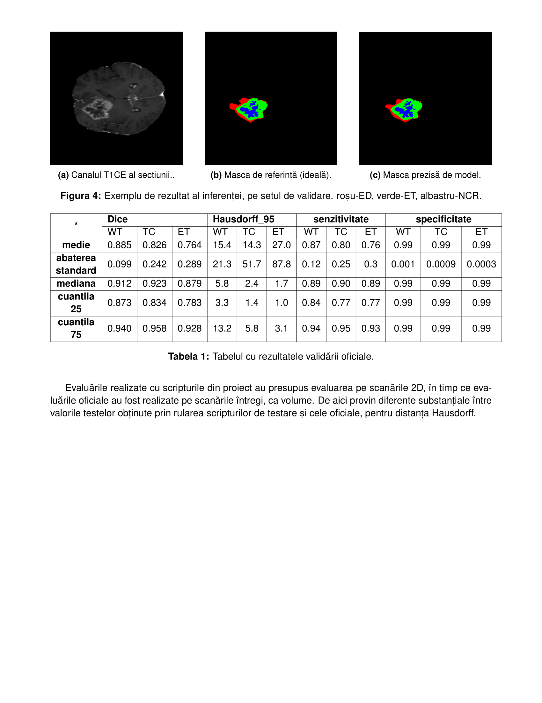

# Tehnici-automate-de-segmentare-semantic-a-tumorilor-cerebrale-folosind-imagini-RMN

Descrierea proiectului poate fi regasita [aici](https://drive.google.com/file/d/1x5_97LY8imy33-ej9Pg5gP1wZTdUU13h/view?usp=sharing).

In interiorul proiectului se regasesc:

1) directorul "core" - se refera la segmentarea BINARA si contine scripturile pentru antrenare, calculare a metricilor, testare, datalaoder, inferenta si arhitecturile retelelor (in subdirectorul networks_folder)

2) directorul "core_multiclasa" - se refera la segmentarea MULTI CLASA si contine scripturile pentru antrenare, calculare a metricilor, testare, datalaoder, inferenta si arhitecturile retelelor (in subdirectorul networks_folder_semantic)

3) celelalte fisiere .py -> cu functii diverse, in principal de manipulare, vizualizare, analizare si preprocesare a datelor

  
 

